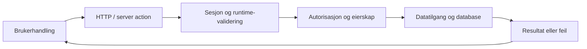

# Teknikk, kodekvalitet og beslutninger

Ingen arkitektur er besluttet. Dette er en **teamstandard og faglig sjekkliste**,
med kurskrav merket T/P. Kilder: [K01 og U26](kilder.md). Bruk bare delene som berører
endringen; hele listen er en gjennomgang før milepæl, ikke ritual for hver linje.

## Første appoppsett

- Velg stack etter T01 og sjekk aktuelle offisielle startinstruksjoner og versjoner.
  Lås faktiske pakkeversjoner i prosjektet; ikke installer alt globalt eller oppdater blindt.
- Dokumenter install/start/build/typecheck/lint, test/dekning, migrasjoner og seed i README.
  En tidligere maskinsjekk av RedwoodSDK er ikke bevis på at denne appen kjører.
- Sett opp full unit/typecheck/lint i CI når remote er godkjent; legg Playwright til når UI finnes.
  Få én liten test til å fange en ekte feil før større funksjoner legges til.
- Kjør lokalt fra ren installasjon på begge maskiner. Ikke gjør Docker eller skydeploy
  obligatorisk uten at valgt oppsett faktisk trenger det.
- Avklar bindinger og runtime: en Cloudflare Worker er ikke en vanlig Node-server.
  Ikke skjul runtimeproblemer med en testmock og kall det produksjonsverifisert.

## Arkitektur uten unødvendige lag

Organiser kode som endres sammen etter funksjon/domene. Én tydelig oppgave per fil.
Skill presentasjon, validering, tilgang og datatilgang når det gir en forståelig grense.
Ikke opprett controller/service/repository for hver enkel funksjon bare fordi en historisk
demo gjorde det. Navn og plassering skal være konsekvente og forklare ansvar.

For første hovedflyt tegner begge denne generiske flyten og erstatter boksene med
ekte fil-/funksjonsnavn. Den er et øvingsbilde, ikke en vedtatt mappestruktur:

Vis også hvor middleware setter request-kontekst, ruten velges og server-/klientgrensen
krysses. Route guard kan avvise sidebesøk; actionen må likevel beskytte sin egen handling.
Avvis uautorisert input før sideeffekt og unngå at sjekk og skriving kan skilles av et race.

## Kontrakt, typer og feilhåndtering

T03: beskriv ressurs, operasjon, metode, parametre/body, respons og status. Bruk for
eksempel 201 ved opprettelse, 400 ved ugyldig input, 401 uten gyldig autentisering,
403 ved manglende rettighet eller konsekvent 404 hvis eksistens skal skjules.
Velg etter faktisk kontrakt; dette er ikke krav om alle statuskoder på alle endepunkter.
Ikke gjør dataskrivende GET eller returner alltid 200 for feil.

Typer ved props, API-/action-input, database og resultat skal henge sammen.
Valider ukjent input på server ved grensen, også når klienten og TypeScript sier den er gyldig.
Dokumenter invariantene: lengder, tomme felt, eierskap, duplikater og manglende ressurs.

Forventede domene-/valideringsfeil kan uttrykkes med et diskriminert Result-union som
UI må håndtere. Uventede unntak håndteres ved passende grense med trygg logging og
generisk brukerbeskjed. Ikke ignorer feil og ikke lag et absolutt forbud mot try/catch.
Se U26 L3 s. 59–80 og L10 s. 217–234.

## React og brukergrensesnitt

- Begrunn hva som kjører på server og hva som trenger klientinteraktivitet. Ikke sett hele
  appen til klient for enkelhets skyld. Serverhemmeligheter må aldri inn i klientpakken.
- Props og callbacks viser hvem som bestemmer atferd. Hold skjemastate lokalt der mulig;
  løft state når flere trenger samme verdi. En custom hook gjenbruker logikk, ikke automatisk state.
- Forklar render, stateoppdatering og async-flyt. Bruk relevante transition/actionState-mønstre
  etter valgt rammeverk, ikke en tilfeldig kopi av et eldre eksempel.
- Vis lasting/pending, tomt resultat, feil, suksess og avvist tilgang. Hindre utilsiktet
  dobbeltinnsending. Gjenopprett forståelig UI etter feil.
- Bruk semantisk HTML, etiketter, fokus, tastaturbetjening, lesbare størrelser og sterk
  kontrast. Prøv mobilbredde og høy zoom uten tapt funksjon eller skjult kontroll.
- Bruk få begrunnede biblioteker. Test hva brukeren kan se og gjøre, ikke intern state.

## Database og tilgang

T02/T04: design eget skjema med nødvendige relasjoner, nullbarhet, unikhet og fremmednøkler.
Knytt validering til skjemaets regler. Migrasjoner beskriver endringer; seed gir syntetiske
data for reproduksjon/demo. Forklar D1/SQLite, JOIN og når indeks hjelper eller koster.

Drizzle-spørringer og korrekt parameteriserte SQL-maler skiller data fra SQL. Ikke påstå at
alle template queries er farlige. Ikke konkatener ubetrodd input til SQL. Test fiendtlig
input som data, behold tabellen og les tilstanden tilbake. Unngå å stole på bruker-ID fra klienten.

Innlogging fastslår hvem du er; autorisasjon avgjør hva du får gjøre. Sjekk sesjon og
ressurseierskap/rolle i **hver relevant skrivehandler**, også ved endring/sletting.
Skjulte knapper, klientvalidering og beskyttede sider er ikke tilgangskontroll alene.

T05: bruk bibliotekets støttede login-/sesjonsflyt. Forklar cookie-attributter,
utlogging og utløp. Bevar Set-Cookie hele veien til nettleseren. U26 s. 261–262 og
s. 269–270 viser ulike authoppskrifter; verifiser valgt mekanisme i offisiell dokumentasjon.
Ikke generaliser «alle authkall må gjennom egen server action» på grunnlag av én øving.

## Teststrategi og bevis

| Nivå | Hva en god test beviser | Vanlig falsk trygghet |
|---|---|---|
| Unit, Vitest | Domene-/valideringsregel med normale tilfeller, kanttilfeller og feil | Testen gjentar implementasjonen eller sjekker bare at funksjonen finnes |
| Komponent | Brukeren kan utføre en oppgave og forstå responsen | Asserter intern state eller detaljer som refaktorering bør kunne endre |
| Integrasjon, T07 | Flere lag samarbeider med ekte skjema/spørringer og kontrollert aktør | DB-stub returnerer alltid suksess |
| E2E, teamgate | Nettleser, app og auth/lagring virker sammen på riktig runtime | En unit-/integrasjonstest får navnet E2E |

L8a bruker in-memory SQLite med migrasjoner og ekte Drizzle-spørringer bak mocket DB-modul.
Mock runtime-/AI-/nettverksgrenser som testen ikke skal være avhengig av; nullstill DB
og fixtures mellom tester. Aktører må være eksplisitte: uten sesjon, riktig eier, annen
innlogget bruker. Et runAs-testoppsett simulerer aktørkontekst; det beviser ikke virkelig
cookie/login i nettleser. Derfor trengs også hovedflytkontroll på appens runtime.

Minimumsplan for den relevante ressursen:

1. Opprett lovlig og les tilbake faktisk lagret verdi.
2. Avvis manglende sesjon (401-sti) og feil bruker/eier, og kontroller at data er uendret.
3. Avvis ugyldig input/manglende ressurs etter kontrakten; test grenseverdier.
4. Verifiser relevant feil fra ekstern tjeneste med deterministisk mock.
5. Vis at testen feiler når den relevante beskyttelsen brytes, uten å beholde brutt kode.

Dette er teamets kvalitetssjekk basert på U26 s. 201, ikke fem ekstra Canvas-innleveringer.
Respekter L8a-kravet om to egne første testversjoner uten KI. Dekning er minst 50 % etter
T07, men hva testene oppdager er viktigere enn å polstre prosenten.

## Sikkerhet, personvern og eksterne tjenester

L13: runtime-validering, SQLi/parametre, XSS/escaping, CSP/nonce, CSRF/Origin/SameSite,
server actions og eierskap. React-escaping gjør ikke vilkårlig HTML automatisk trygt.
Avklar avhengigheter og lisenser, ikke kopier KI-kode ukritisk. Ingen hemmeligheter i
repo, klient, fixtures eller promptlogger. `.gitignore` fjerner ikke allerede committede data.

Ved KI-funksjon: bruk bare nødvendige data, server-side hemmeligheter, håndter timeout,
kostnad, uventet modelloutput og prompt injection. Ved RAG er hentet tekst ubetrodd input;
kilder/grounding gir ikke garanti for riktighet. Ved opplasting: størrelses-/typekontroll,
tilgang, lagring, sletting og kostnad. Ved cron: UTC, idempotens, retries og observasjon.
Disse funksjonene bygges bare hvis de blir valgt; prinsippene øves uansett.

Juridiske utsagn i pensum er daterte undervisningskilder. For faktisk behandling av
personopplysninger, lisensvalg eller regulatorisk vurdering må gjeldende offisielle
kilder kontrolleres; ikke bruk denne sjekklisten som juridisk fasit.

## Kort beslutningsmal

Bruk ved vesentlige teknologi-/arkitekturvalg. Ikke fyll ut studentenes resonnement med KI.
Det er nok å legge en liten seksjon i prosjektkortet til behovet for egen ADR-fil finnes.

- ID/dato, status (foreslått/valgt/erstattet), forfatter og krav-ID.
- **Valg:** hva velger vi, for hvilket konkret problem?
- **Alternativ:** hvilket realistisk alternativ ble vurdert?
- **Kostnad:** hva taper vi, og hvem merker det?
- **Endret krav:** hva ville fått oss til å velge annerledes?
- Faktisk evidens: test, kode, måling eller dokumentasjon. Åpne spørsmål og konsekvenser.

Skillet mellom en teknisk faktakilde og studentens egen begrunnelse må være synlig.
«Moderne», «skalerbart» og «best practice» uten konkret behov er ikke en forklaring.
